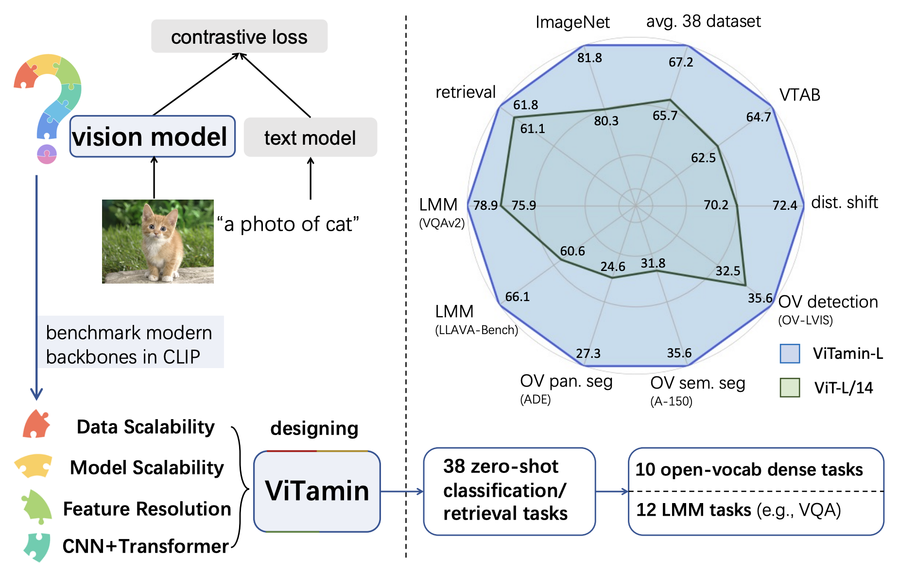

# [ViTamin: Designing Scalable Vision Models in the Vision-language Era](https://arxiv.org/pdf/2404.02132.pdf)

🔥 ViTamin-XL, with only **436M** parameters and trained on the public DataComp-1B dataset, achieves an impressive **82.9%** zero-shot ImageNet accuracy.

🔥 ViTamin sets a new SOTA across seven benchmarks for open-vocabulary segmentation.

<!-- [ViTamin: Designing Scalable Vision Models in the Vision-language Era](https://arxiv.org/pdf/2404.02132.pdf).\
✨ &ensp;[Jieneng Chen](https://beckschen.github.io), [Qihang Yu](https://yucornetto.github.io/), [Xiaohui Shen](https://xiaohuishen.github.io/), [Alan Yuille](https://www.cs.jhu.edu/~ayuille/) and [Liang-Chieh Chen](http://liangchiehchen.com/)\
🏠 &ensp;Johns Hopkins University, Bytedance -->

<p>

</p>

## Get Started
It currently includes code and models for the following tasks:

> **ViTamin Pre-training**: See [./ViTamin/README.md](https://github.com/Beckschen/ViTamin/blob/main/ViTamin/README.md) for a quick start, which includes CLIP pre-training / fine-tuning pipelines and zero-shot evaluation pipelines.

> **Open-vocabulary Detection and Segmentation**: See [ViTamin for Open-vocab Detection](https://github.com/Beckschen/ViTamin/vitamin_fvit) and [ViTamin for Open-vocab Segmentation](https://github.com/Beckschen/ViTamin/vitamin_fcclip) (Will release few hours later).

> **Large Multi-Modal Models**: See [ViTamin for Large Multi-Modal Models](https://github.com/Beckschen/ViTamin/vitamin_llava).


We also support ViTamin with Hugging Face model [jienengchen/ViTamin-XL-384px](https://huggingface.co/jienengchen/ViTamin-XL-384px).

```python
import torch
from PIL import Image
from transformers import AutoModel, CLIPImageProcessor
device = "cuda" if torch.cuda.is_available() else "cpu"

model = AutoModel.from_pretrained(
    'jienengchen/ViTamin-XL-384px',
    trust_remote_code=True).to(device).eval()

image = Image.open('./image.png').convert('RGB')
image_processor = CLIPImageProcessor.from_pretrained('jienengchen/ViTamin-XL-384px')

pixel_values = image_processor(images=image, return_tensors='pt').pixel_values
pixel_values = pixel_values.to(torch.bfloat16).cuda()

tokenizer = open_clip.get_tokenizer('hf-hub:laion/CLIP-ViT-L-14-DataComp.XL-s13B-b90K')
text = tokenizer(["a photo of vitamin", "a dog", "a cat"]).to(device)

with torch.no_grad(), torch.cuda.amp.autocast():
    image_features, text_features, logit_scale = model(pixel_values, text)
    text_probs = (100.0 * image_features @ text_features.to(torch.float).T).softmax(dim=-1)

print("Label probs:", text_probs) 

```
## Main Results with CLIP Pre-training on DataComp-1B

We will provide 61 trained VLMs (48 benchmarked + 13 best performing) in Hugging Face for community use. Stay tuned!

| image encoder | image size | num patches | text encoder depth/width | seen samples (B)  | trainable params Image+Text (M) | MACs Image+Text (G)  | ImageNet Acc. | avg. 38 datasets | ImageNet dist. shift. | VTAB | retrieval |
|---------------|------------|-------------|--------------------------|-------------------|---------------------------------|----------------------|---------------|------------------|-----------------------|------|-----------|
| ViTamin-L     | 224        | 196         | 12/768                   | 12.8              | 333.3+123.7                     | 72.6+6.6             | 80.8          | 66.7             | 69.8                  | 65.3 | 60.3      |
| ViTamin-L     | 256        | 256         | 12/768                   | 12.8+0.2          | 333.4+123.7                     | 94.8+6.6             | 81.2          | 67.0             | 71.1                  | 65.3 | 61.2      |
| ViTamin-L     | 336        | 441         | 12/768                   | 12.8+0.2          | 333.6+123.7                     | 163.4+6.6            | 81.6          | 67.0             | 72.1                  | 64.4 | 61.6      |
| ViTamin-L     | 384        | 576         | 12/768                   | 12.8+0.2          | 333.7+123.7                     | 213.4+6.6            | 81.8          | 67.2             | 72.4                  | 64.7 | 61.8      |
| ViTamin-L2    | 224        | 196         | 24/1024                  | 12.8              | 333.6+354.0                     | 72.6+23.3            | 80.9          | 66.4             | 70.6                  | 63.4 | 61.5      |
| ViTamin-L2    | 256        | 256         | 24/1024                  | 12.8+0.5          | 333.6+354.0                     | 94.8+23.3            | 81.5          | 67.4             | 71.9                  | 64.1 | 63.1      |
| ViTamin-L2    | 336        | 441         | 24/1024                  | 12.8+0.5          | 333.8+354.0                     | 163.4+23.3           | 81.8          | 67.8             | 73.0                  | 64.5 | 63.6      |
| ViTamin-L2    | 384        | 576         | 24/1024                  | 12.8+0.5          | 334.0+354.0                     | 213.4+23.3           | 82.1          | 68.1             | 73.4                  | 64.8 | 63.7      |
| ViTamin-XL    | 256        | 256         | 27/1152                  | 12.8+0.5          | 436.1+488.7                     | 125.3+33.1           | 82.1          | 67.6             | 72.3                  | 65.4 | 62.7      |
| ViTamin-XL    | 384        | 576         | 27/1152                  | 12.8+0.5          | 436.1+488.7                     | 281.9+33.1           | 82.6          | 68.1             | 73.6                  | 65.6 | 63.8      |
| ViTamin-XL    | 256        | 256         | 27/1152                  | 40                | 436.1+488.7                     | 125.3+33.1           | 82.3          | 67.5             | 72.8                  | 64.0 | 62.1      |
| ViTamin-XL    | 336        | 441         | 27/1152                  | 40+1              | 436.1+488.7                     | 215.9+33.1           | 82.7          | 68.0             | 73.9                  | 64.1 | 62.6      |
| ViTamin-XL    | 384        | 576         | 27/1152                  | 40+1              | 436.1+488.7                     | 281.9+33.1           | 82.9          | 68.1             | 74.1                  | 64.0 | 62.5      |

## Main Results on Downstream tasks
**Open-Vocab Detection**
| image encoder | detector   | OV-COCO (AP<sub>50</sub><sup>novel</sup>) | OV-LVIS (AP<sub>r</sub>) |
|---------------|----------|---------------------------------------|-----------------------|
| ViT-L/14      | Sliding F-ViT | 36.1                                  | 32.5                  |
| ViTamin-L     | Sliding F-ViT  | 37.5                                | 35.6              |

**Open-Vocab Segmentation**

| image encoder | segmentor      | ADE            | Cityscapes   | MV   | A-150 | A-847 | PC-459 | PC-59 | PAS-21             |
|---------------|-------------|----------------|--------------|------|-------|-------|--------|-------|--------------------|
| ViT-L/14      | Sliding FC-CLIP  | 24.6           | 40.7         | 16.5 | 31.8  | 14.3  | 18.3   | 55.1  | 81.5               |
| ViTamin-L     | Sliding FC-CLIP  | 27.3           | 44.0     | 18.2 | 35.6 | 16.1 | 20.4 | 58.4 | 83.4 |

Note: Panoptic dataset (ADE, CityScapes, MV) are with the metric of PQ. Semantic dataset (A-150, A-847, PC-459, PC-59, PAS-21) are with the metric of mIoU.

**Large Multi-modal Models**

| image encoder      | image size | VQAv2 | GQA  | VizWiz | SQA  | T-VQA | POPE | MME  | MM-Bench | MM-B-CN | SEED | LLaVA-Wild | MM-Vet |
|---------------|----------|-------|------|--------|------|-------|------|------|----------|---------|------|------------|--------|
| ViTamin-L   | 224 | 78.4  | 61.6 | 51.1   | 66.9 | 58.7  | 84.6 | 1421 | 65.4     | 58.4    | 57.7 | 64.5       | 33.6   |
| ViTamin-L   | 384 | 78.9  | 61.6 | 55.4   | 67.6 | 59.8  | 85.5 | 1447 | 64.5     | 58.3    | 57.9 | 66.1       | 33.6   |


## Citing ViTamin

```
@inproceedings{chen2024vitamin,
  title={ViTamin: Designing Scalable Vision Models in the Vision-language Era},
  author={Chen, Jieneng and Yu, Qihang and Shen, Xiaohui and Yuille, Alan and Chen, Liang-Chieh},
  booktitle={Proceedings of the IEEE/CVF Conference on Computer Vision and Pattern Recognition},
  year={2024}
}